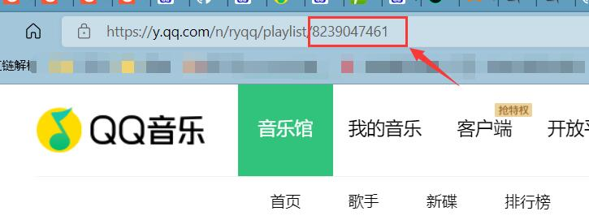

自己的博客，搭配上自己的歌单，写起来才更方松。配置过程比较简单，在博客页面中添加Metingjs代码，接着填入歌单信息就行。

<!--more-->

### 1.获取歌单信息

将自己的想添加的歌单分享出去，然后在浏览器上打开，其中的一串数，或者是`id=`，就是要获得信息。



### 2.添加Metingjs代码到侧边栏

在`themes\next\layout\_macro\sidebar.swig`找到类名为`sidebar-inner`的代码块位置：

```html
<!-- require APlayer -->
      <link rel="stylesheet" href="https://cdn.jsdelivr.net/npm/aplayer@1.10.1/dist/APlayer.min.css">

      <script src="https://cdn.jsdelivr.net/npm/aplayer@1.10.1/dist/APlayer.min.js"></script>
      <!-- require MetingJS-->

      <script src="https://cdn.jsdelivr.net/npm/meting@2.0.1/dist/Meting.min.js"></script> 
      <!--playlist外链地址-->   
      <meting-js
          server="tencent"
          type="playlist" 
          id="8239047461"
          mini="false"
          fixed="false"
          list-folded="true"
          autoplay="false"
          volume="0.4"
          theme="#FADFA3"
          order="list"
          loop="all"
          preload="auto"
          lrc-type="1"
          mutex="true">
      </meting-js>
```


代码的具体含义可以参照官方文档：[APlayer](https://aplayer.js.org/#/home)，[MetingJS](https://github.com/metowolf/MetingJS)。

其中`server`,` type`,`id`,需要修改，我这里使用的是QQ音乐的歌单

### 3.实现全局播放

打开`themes\next\layout`文件夹找到`_layout.swig`，并复制以下代码到`<head>`标签后
```html
<!--pjax：防止跳转页面音乐暂停-->
<script src="https://cdn.jsdelivr.net/npm/pjax@0.2.8/pjax.js"></script>
```


在`themes\next\_config.yml`中找到`pajx`，将它设置为`true`


后面就可以通过`hexo`命令生成界面了。


### 参考：

[Hexo博客设置背景音乐_Z先森9701的博客-CSDN博客](https://blog.csdn.net/qq_39800978/article/details/109407258?utm_medium=distribute.pc_relevant.none-task-blog-2~default~baidujs_baidulandingword~default-1.no_search_link&spm=1001.2101.3001.4242.2)
