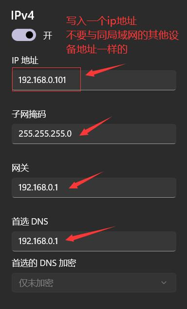

使用实验室的485转网口的转换器，完成485传感器的tcp通讯。

<!--more-->

### 实验设备：

- 通讯转换模块（USR-DR302）
- 485传感器（WT61-PC485)

### 1.连接线路

正确连接转换器上的接口：

```
PC(网口)<----网口---->转换器（USR-DR302）<----A/T和B/R---->485传感器（WT61-PC485）
```

**正确连接信号线和电源线**，信号灯会进行闪烁。

### 2.配置PC端IP

打开电脑的网络设置，设置以太网Ipv4分配。








### 3.配置通讯转换器（USR-DR302）

在浏览器上输入ip地址`192.168.0.7`会弹出一个页面。


如果没有弹出页面：

- 一种可能是线路连接问题，检查一遍线路。
- 还有一种可能是将设备模块的`默认ip`被修改了，可以通过[串口AT指令](https://www.usr.cn/Down/USR-DR302_V1.0.3.pdf)查询或者`重置`。

### 4.配置本机ip设置


除了`ip地址`不同（不冲突，建议默认），其他的`子网掩码`，`网关地址`，`DNS服务器`和在PC配置的`IPv4`一样。完成后，`重启`模块。

### 5.配置端口参数


```yml
波特率: 9600    #所使用的传感器在这个频段，WT61-PC485在这个频段
本地端口: 8000	#可以随意给一个
工作方式: TCP Server 
```

完成后，`重启`模块

### 6.配置扩散功能

打开`Modbus TCP`功能


完成后，`重启`模块

### 7.测试通讯

打开[TCP串口调试助手](https://www.usr.cn/Down/Software/USR-TCP232-Test-V1.3.exe)，或者网络调试助手。


按图示操作，中间区域出现所要接收的报文，说明通讯成功。

```yml
协议类型: TCP Client    
服务器IP地址: 192.168.0.7	#转换器模块的IP地址
服务器端口号: 8000		#转换器模块的本地端口

报文: 
	modbusTCP表头: 00 00 00 00 00 06 		#后两个字节是数据报文的长度
	数据报文: 50 03 00 3d 00 03			#除去CRC校验码的报文
```

